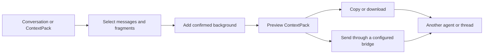

# Context Relay

**Select the exact parts that matter, attach confirmed context, and continue with another agent or thread.**

[简体中文](README.zh-CN.md) · [Protocol](docs/PROTOCOL.md) · [Integration guide](docs/INTEGRATION.md) · [Model setup](docs/MODELS.md)

Agent conversations often contain one useful decision inside a long history. Copying the whole thread adds noise and may expose unrelated details; copying one sentence loses its source and the constraints around it. Context Relay turns selected messages and text fragments into a portable, inspectable **ContextPack**.

## See it work


Select a passage, keep its exact wording and source references, then ask a question about it. The image visualizes an actual generated pack: unselected surrounding text stays out, and proposed background remains excluded until confirmed. The conversation is synthetic; no host transfer or model call is implied.

[Inspect the pack](examples/conformance/partial-message.pack.json) · [Recorded example values](docs/demo-result.json)

```sh
node src/cli.mjs open examples/conformance/partial-message.source.json --port 6400
```

## What it solves

- Carry several non-adjacent messages or exact text fragments together.
- Preserve speaker, source, order, stable reference IDs, and user-confirmed background.
- Add a focused follow-up question without silently including the rest of the conversation.
- Preview, copy, download, import, and forward the same package through a local UI, CLI, MCP tools, or an Agent Skill.
- Keep offline selection and export independent from optional model assistance.



## Quick start

Requires Node.js 22 or later. The local selector has no production npm dependencies.

```sh
node src/cli.mjs serve
```

Open `http://127.0.0.1:6400`, then:

1. Import a JSON/JSONL conversation or an existing ContextPack.
2. Select complete messages or precise text ranges.
3. Add the context the receiver needs and write the next question.
4. Review the package, then copy or download it.

Instead of starting an empty selector with `serve`, import a supplied file directly into its own draft:

```sh
node src/cli.mjs open examples/demo-history.json --port 6400
```

The command prints a draft-specific URL and keeps the selector running. It accepts a conversation, ContextPack, or full draft backup. Open that URL again after restarting `serve` to continue the same draft. With an explicitly configured host connection, `node src/cli.mjs open-thread EXISTING_THREAD_ID --port 6400` reads the selected thread once and opens an independent draft. It does not discover host endpoints or inject controls into the host's message UI.

Drafts, exports, and delivery receipts stay under the project’s local `.runtime/` directory. Multiple browser windows use conflict-safe drafts so one edit does not silently overwrite another. History and quoted text are stored as immutable objects; routine question edits save small fields instead of retransmitting the whole history. Background edits still validate their source relationships.

For a portable backup, download the **full draft backup**. To move internal storage, copy the complete `.runtime/app-state/` directory, including its objects. A draft index alone is not self-contained. Full backups can contain unselected history and unchecked background; use a reviewed ContextPack for sharing. Custom basket order changes the display only; exported reference numbers and canonical order remain unchanged.

## MCP and Agent Skill

Build the portable plugin package:

```sh
node scripts/package.mjs
```

Run `node scripts/configure-plugin.mjs` inside the generated package to create a local stdio MCP configuration. The package exposes tools for importing, selecting, packing, previewing, exporting, and—when an explicit bridge is configured—sending to an existing destination.

The included Skill guides an agent through the same ContextPack workflow. It does not grant access to private conversation stores or guess destination IDs.

For interactive selection, `relay_import_open` and `relay_read_thread_open` create an independent draft and return its URL. `relay_selector` can reopen that `draftId`. The original import, pack, preview, and export tools remain available for workflows without a browser.

## Delivery recovery

If a pre-send receipt is blocked by a lock, diagnose it first:

```sh
node src/cli.mjs lock-diagnose RECEIPT_ID
```

Only when the result says it is recoverable, explicitly release that lock using the returned token:

```sh
node src/cli.mjs lock-recover RECEIPT_ID DIAGNOSTIC_LOCK_TOKEN --confirm
```

Recovery verifies the lock generation and its inactive owner while holding a local exclusion guard. It does not send, alter the receipt, or trigger a retry. Active, legacy, damaged, or unverifiable locks remain blocked. Attempted or unknown delivery requires read-only reconciliation; it is never automatically resent. See the [delivery contract](docs/INTEGRATION.md#delivery-and-recovery).

## Optional model support

Selection, packaging, validation, copying, and export work without a model. Optional answer and context suggestions support:

- an OpenAI-compatible external API configured with your own endpoint and key environment variable;
- a local Codex CLI profile using its normal ChatGPT sign-in and account allowance.

Model output is advisory. A delayed response cannot overwrite a package that the user has edited since the request began. See [model setup](docs/MODELS.md).

## Data model

A ContextPack separates quoted evidence from the receiver prompt:

| Part | Purpose |
| --- | --- |
| `schemaVersion`, `packId`, `createdAt` | Protocol version and package identity |
| `excerpts` | Exact selected text with role, order, reference ID, source fields, text hashes, and UTF-16 range |
| `memory` | Background, constraints, decisions, or open questions, each linked to source excerpt IDs with its confirmation status |
| `question` | The focused request for the receiving agent |

Source metadata lives on each excerpt: `sourceThreadId`, `sourceTurnId`, `sourceItemId`, `sourceUri`, and `sourceKind`. Missing source identifiers remain `null`. `sourceHash` describes the whole source message; `excerptHash` describes only `exactText`. A model-proposed memory entry must remain excluded until the user confirms it.

Generate a valid package with the built-in helpers. Run this JavaScript as an ES module from the repository root:

```js
import { importHistory, createPack, validatePack } from './src/core.mjs';

const history = importHistory({
  messages: [{ role: 'user', content: 'Keep the delivery offline.' }],
});
const pack = createPack(history, [
  { localId: history.messages[0].localId },
], { question: 'Which implementation fits this constraint?' });

console.log(JSON.stringify(validatePack(pack), null, 2));
```

This selects the whole message and leaves `memory` empty. The generator supplies IDs, timestamps, hashes, and ranges. See the complete [ContextPack schema](schemas/context-pack.schema.json) before constructing packages manually.

## Scope and privacy

- Context Relay is a companion selector and transport layer; it does not modify the native message UI of Codex or other hosts.
- It reads only files or host connections that the user explicitly provides and validates.
- Conflicting role or source aliases in explicitly typed App Server/rollout input are rejected as `HISTORY_PROVENANCE_CONFLICT`; a failed import leaves the saved draft intact. Unknown source identifiers stay unknown.
- Local drafts and exports are plain files. Review a ContextPack before sharing it because selected text may contain sensitive information.
- Host delivery is disabled until a concrete connection and destination are configured. Export-only mode remains available at all times.

## Repository guide

- [`web/`](web/) — local selection interface
- [`src/`](src/) — CLI, ContextPack logic, MCP server, and model bridge
- [Plugin and Skill template](https://github.com/liulinlin718-netizen/codex-context-relay/tree/codex/public-release/plugin/codex-context-relay) — repository layout; release bundles place the plugin manifest and Skill at their root
- [`docs/PROTOCOL.md`](docs/PROTOCOL.md) — package and delivery contract
- [`docs/INTEGRATION.md`](docs/INTEGRATION.md) — host and plugin integration
- [`examples/`](examples/) — synthetic examples

## Contributing

Run the deterministic test suite before opening a pull request:

```sh
npm test
node scripts/generate-conformance-fixtures.mjs --check
```

The [conformance fixtures](examples/conformance/manifest.json) cover full messages, partial excerpts, unknown sources, and rollout history. They are synthetic inputs generated through the real producer. Consumers should preserve whole-message and excerpt hashes separately and keep their own approval decision independent from import.

Issues and focused pull requests are welcome, especially around conversation import formats, provenance, accessibility, and safe handoff behavior.

Licensed under the [MIT License](LICENSE).
