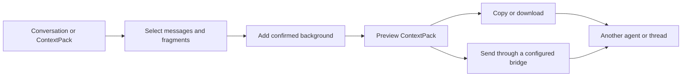

# Context Relay

**Select the exact parts that matter, attach confirmed context, and continue with another agent or thread.**

[简体中文](README.zh-CN.md) · [Protocol](docs/PROTOCOL.md) · [Integration guide](docs/INTEGRATION.md) · [Model setup](docs/MODELS.md)

Agent conversations often contain one useful decision inside a long history. Copying the whole thread adds noise and may expose unrelated details; copying one sentence loses its source and the constraints around it. Context Relay turns selected messages and text fragments into a portable, inspectable **ContextPack**.

## What it solves

- Carry several non-adjacent messages or exact text fragments together.
- Preserve speaker, source, order, stable reference IDs, and user-confirmed background.
- Add a focused follow-up question without silently including the rest of the conversation.
- Preview, copy, download, import, and forward the same package through a local UI, CLI, MCP tools, or an Agent Skill.
- Keep offline selection and export independent from optional model assistance.



## Quick start

Requires Node.js 22 or later. The local selector has no production npm dependencies.

```sh
node src/cli.mjs serve
```

Open `http://127.0.0.1:6400`, then:

1. Import a JSON/JSONL conversation or an existing ContextPack.
2. Select complete messages or precise text ranges.
3. Add the context the receiver needs and write the next question.
4. Review the package, then copy or download it.

Drafts, exports, and delivery receipts stay under the project’s local `.runtime/` directory. Multiple browser windows use conflict-safe drafts so one edit does not silently overwrite another.

## MCP and Agent Skill

Build the portable plugin package:

```sh
node scripts/package.mjs
```

Run `node scripts/configure-plugin.mjs` inside the generated package to create a local stdio MCP configuration. The package exposes tools for importing, selecting, packing, previewing, exporting, and—when an explicit bridge is configured—sending to an existing destination.

The included Skill guides an agent through the same ContextPack workflow. It does not grant access to private conversation stores or guess destination IDs.

## Optional model support

Selection, packaging, validation, copying, and export work without a model. Optional answer and context suggestions support:

- an OpenAI-compatible external API configured with your own endpoint and key environment variable;
- a local Codex CLI profile using its normal ChatGPT sign-in and account allowance.

Model output is advisory. A delayed response cannot overwrite a package that the user has edited since the request began. See [model setup](docs/MODELS.md).

## Data model

A ContextPack separates quoted evidence from the receiver prompt:

| Part | Purpose |
| --- | --- |
| `items` | Exact selected text with role, source, order, and reference ID |
| `background` | Context explicitly confirmed by the sender |
| `question` | The focused request for the receiving agent |
| `provenance` | Known source metadata without inventing missing information |

The schema is documented in [`schemas/`](schemas/). Unknown provenance remains unknown rather than being inferred.

## Scope and privacy

- Context Relay is a companion selector and transport layer; it does not modify the native message UI of Codex or other hosts.
- It reads only files or host connections that the user explicitly provides and validates.
- Local drafts and exports are plain files. Review a ContextPack before sharing it because selected text may contain sensitive information.
- Host delivery is disabled until a concrete connection and destination are configured. Export-only mode remains available at all times.

## Repository guide

- [`web/`](web/) — local selection interface
- [`src/`](src/) — CLI, ContextPack logic, MCP server, and model bridge
- [`plugin/`](plugin/) — portable plugin and Skill template
- [`docs/PROTOCOL.md`](docs/PROTOCOL.md) — package and delivery contract
- [`docs/INTEGRATION.md`](docs/INTEGRATION.md) — host and plugin integration
- [`examples/`](examples/) — synthetic examples

## Contributing

Run the deterministic test suite before opening a pull request:

```sh
npm test
```

Issues and focused pull requests are welcome, especially around conversation import formats, provenance, accessibility, and safe handoff behavior.

Licensed under the [MIT License](LICENSE).
