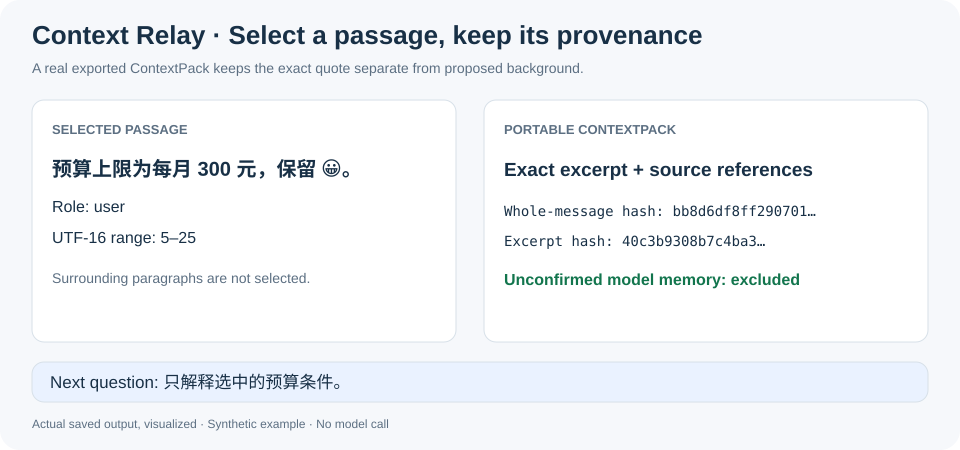
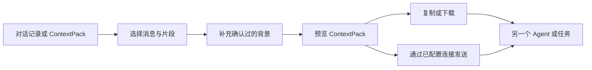

# Context Relay · 引用接力

**精确选择需要的对话内容，补充确认过的背景，再交给另一个 Agent 或任务继续处理。**

[English](README.md) · [协议说明](docs/PROTOCOL.md) · [接入指南](docs/INTEGRATION.md) · [模型配置](docs/MODELS.md)

一段 Agent 对话里，真正需要转交的往往只有几个决定、约束和原话。复制整段历史会带来噪声，也可能泄露无关内容；只复制一句话又容易丢失来源和上下文。Context Relay 把多条消息和精确文本片段整理成可携带、可检查的 **ContextPack**。

## 实际效果



选一段原文，保留原话和来源，再围绕它继续提问。图中可视化的是实际生成的引用包：未选前后文不会混入，未确认的背景提议保持排除。对话为合成材料，不代表宿主转发或模型调用。

[查看实际引用包](examples/conformance/partial-message.pack.json) · [演示数据](docs/demo-result.json)

```sh
node src/cli.mjs open examples/conformance/partial-message.source.json --port 6400
```

## 它解决什么问题

- 同时携带多条不连续消息或精确文本片段。
- 保留角色、来源、顺序、稳定引用编号和用户确认过的背景。
- 加入一个明确的后续问题，不暗中捎带未选中的聊天记录。
- 通过本地界面、CLI、MCP 工具或 Agent Skill 预览、复制、下载、导入和转发同一份引用包。
- 离线选择与导出不依赖模型；模型能力只是可选增强。



## 快速开始

需要 Node.js 22 或更高版本。本地选择器没有生产环境 npm 依赖。

```sh
node src/cli.mjs serve
```

打开 `http://127.0.0.1:6400`，然后：

1. 导入 JSON／JSONL 对话记录或已有 ContextPack。
2. 选择完整消息，或框选其中的精确文字。
3. 写入接收方需要的背景和接下来要问的问题。
4. 检查引用包，再复制或下载。

也可以用下面的入口代替 `serve`，直接把用户提供的文件导入独立草稿：

```sh
node src/cli.mjs open examples/demo-history.json --port 6400
```

命令会打印草稿专属 URL，并保持选择器运行。文件可以是对话记录、ContextPack 或完整草稿备份；重启 `serve` 后再次打开该 URL 即可继续。显式配置宿主连接后，`node src/cli.mjs open-thread EXISTING_THREAD_ID --port 6400` 会读取指定任务一次，再打开独立草稿。它不会发现宿主端点，也不会往宿主原生消息界面注入控件。

草稿、导出和发送回执保存在项目本地的 `.runtime/` 目录。多个浏览器窗口使用冲突安全的独立草稿，避免互相静默覆盖。历史与引用正文作为不可变对象存储，日常修改问题只保存小字段，不再重复传输整份历史；背景修改仍会核验来源关系。

需要可搬移备份时，下载**完整草稿备份**；迁移内部存储时，复制包含所有 objects 的整个 `.runtime/app-state/` 目录，单独索引文件不能独立恢复。完整备份可能包含未选历史和未勾选背景，分享时应使用检查过的 ContextPack。引用篮的自定义顺序仅影响展示，导出引用编号与规范顺序保持不变。

## MCP 与 Agent Skill

生成可搬移的插件包：

```sh
node scripts/package.mjs
```

在生成的包内运行 `node scripts/configure-plugin.mjs`，即可创建本地 stdio MCP 配置。工具覆盖导入、选择、打包、预览、导出，以及在显式配置连接后向已有目标发送。

仓库中的 Skill 会引导 Agent 使用同一套 ContextPack 流程。它不会读取未授权的私有对话库，也不会猜测目标任务 ID。

交互式选择可用 `relay_import_open` 或 `relay_read_thread_open`，它们创建独立草稿并返回 URL；`relay_selector` 可按该 `draftId` 重新打开。无需浏览器的流程仍可使用原有导入、打包、预览和导出工具。

## 发送恢复

如果发送前回执被锁阻挡，先进行诊断：

```sh
node src/cli.mjs lock-diagnose RECEIPT_ID
```

仅当结果明确表示可以恢复时，使用返回的令牌显式解除该锁：

```sh
node src/cli.mjs lock-recover RECEIPT_ID DIAGNOSTIC_LOCK_TOKEN --confirm
```

恢复会在持有本地互斥保护时核验锁的代际和失效所有者，不会发送、修改回执或触发重试。活跃、旧版、损坏或无法确认所有者的锁继续保持阻挡。已经尝试发送或状态 unknown 的交付只做只读核查，绝不自动重发。详见[发送合同](docs/INTEGRATION.md#delivery-and-recovery)。

## 可选模型能力

选择、打包、校验、复制和导出都不需要模型。可选的回答与背景建议支持：

- 使用自有端点与密钥环境变量的 OpenAI 兼容外部 API；
- 通过正常 ChatGPT 登录和账号额度运行的本地 Codex CLI 独立 profile。

模型输出只作为建议。请求发出后如果用户修改了引用包，迟到的响应不会覆盖新内容。具体配置见[模型说明](docs/MODELS.md)。

## 数据结构

ContextPack 把引用证据与接收方问题明确分开：

| 部分 | 作用 |
| --- | --- |
| `schemaVersion`、`packId`、`createdAt` | 协议版本与引用包标识 |
| `excerpts` | 精确引用文字，以及角色、顺序、引用编号、来源字段、文本哈希和 UTF-16 范围 |
| `memory` | 背景、约束、决定或待解决问题；每条关联来源引用 ID，并记录确认状态 |
| `question` | 交给接收 Agent 的聚焦问题 |

来源信息保存在各条 excerpt 的 `sourceThreadId`、`sourceTurnId`、`sourceItemId`、`sourceUri` 和 `sourceKind` 中；未知的来源标识保持为 `null`。`sourceHash` 对应整条源消息，`excerptHash` 仅对应 `exactText`。模型建议的记忆在用户确认前不能被纳入发送内容。

可以用内置函数生成有效引用包。以下 JavaScript 从仓库根目录以 ES module 方式运行：

```js
import { importHistory, createPack, validatePack } from './src/core.mjs';

const history = importHistory({
  messages: [{ role: 'user', content: 'Keep the delivery offline.' }],
});
const pack = createPack(history, [
  { localId: history.messages[0].localId },
], { question: 'Which implementation fits this constraint?' });

console.log(JSON.stringify(validatePack(pack), null, 2));
```

这个示例选择整条消息，`memory` 为空；ID、时间戳、哈希和范围由生成器填写。手工构造时请遵循完整的 [ContextPack schema](schemas/context-pack.schema.json)。

## 使用边界与隐私

- Context Relay 是伴随式选择与传输工具，不修改 Codex 或其他宿主的原生消息界面。
- 它只读取用户明确提供并验证的文件或宿主连接。
- 明确类型的 App Server／rollout 输入若角色或来源别名互相冲突，会返回 `HISTORY_PROVENANCE_CONFLICT`；导入失败保留已保存草稿，未知来源标识仍保持未知。
- 本地草稿和导出是普通文件。分享前请检查 ContextPack，因为所选原文可能含有敏感信息。
- 在配置具体连接和接收目标前，宿主发送功能保持关闭；纯导出模式始终可用。

## 仓库结构

- [`web/`](web/)：本地选择界面
- [`src/`](src/)：CLI、ContextPack 逻辑、MCP 服务和模型桥接
- [插件与 Skill 模板](https://github.com/liulinlin718-netizen/codex-context-relay/tree/codex/public-release/plugin/codex-context-relay)：仓库布局；发行包将插件清单与 Skill 放在包根目录
- [`docs/PROTOCOL.md`](docs/PROTOCOL.md)：引用包与发送协议
- [`docs/INTEGRATION.md`](docs/INTEGRATION.md)：宿主和插件接入方式
- [`examples/`](examples/)：合成示例

## 参与贡献

提交 PR 前运行确定性测试：

```sh
npm test
node scripts/generate-conformance-fixtures.mjs --check
```

[一致性夹具](examples/conformance/manifest.json) 包含全文、局部引用、未知来源和 rollout 历史，均使用真实生产者生成合成输入。消费方应分别保留整消息与片段哈希，并保持导入和自身批准决定相互独立。

欢迎提交 Issue 和聚焦的 PR，尤其是对话导入格式、来源追踪、无障碍体验和安全交接方面的改进。

本项目采用 [MIT License](LICENSE)。
