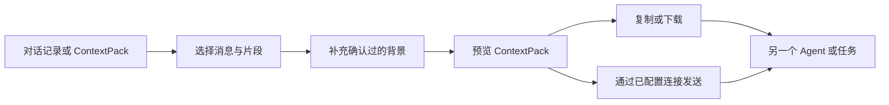

# Context Relay · 引用接力

**精确选择需要的对话内容，补充确认过的背景，再交给另一个 Agent 或任务继续处理。**

[English](README.md) · [协议说明](docs/PROTOCOL.md) · [接入指南](docs/INTEGRATION.md) · [模型配置](docs/MODELS.md)

一段 Agent 对话里，真正需要转交的往往只有几个决定、约束和原话。复制整段历史会带来噪声，也可能泄露无关内容；只复制一句话又容易丢失来源和上下文。Context Relay 把多条消息和精确文本片段整理成可携带、可检查的 **ContextPack**。

## 它解决什么问题

- 同时携带多条不连续消息或精确文本片段。
- 保留角色、来源、顺序、稳定引用编号和用户确认过的背景。
- 加入一个明确的后续问题，不暗中捎带未选中的聊天记录。
- 通过本地界面、CLI、MCP 工具或 Agent Skill 预览、复制、下载、导入和转发同一份引用包。
- 离线选择与导出不依赖模型；模型能力只是可选增强。



## 快速开始

需要 Node.js 22 或更高版本。本地选择器没有生产环境 npm 依赖。

```sh
node src/cli.mjs serve
```

打开 `http://127.0.0.1:6400`，然后：

1. 导入 JSON／JSONL 对话记录或已有 ContextPack。
2. 选择完整消息，或框选其中的精确文字。
3. 写入接收方需要的背景和接下来要问的问题。
4. 检查引用包，再复制或下载。

草稿、导出和发送回执保存在项目本地的 `.runtime/` 目录。多个浏览器窗口使用冲突安全的独立草稿，避免互相静默覆盖。

## MCP 与 Agent Skill

生成可搬移的插件包：

```sh
node scripts/package.mjs
```

在生成的包内运行 `node scripts/configure-plugin.mjs`，即可创建本地 stdio MCP 配置。工具覆盖导入、选择、打包、预览、导出，以及在显式配置连接后向已有目标发送。

仓库中的 Skill 会引导 Agent 使用同一套 ContextPack 流程。它不会读取未授权的私有对话库，也不会猜测目标任务 ID。

## 可选模型能力

选择、打包、校验、复制和导出都不需要模型。可选的回答与背景建议支持：

- 使用自有端点与密钥环境变量的 OpenAI 兼容外部 API；
- 通过正常 ChatGPT 登录和账号额度运行的本地 Codex CLI 独立 profile。

模型输出只作为建议。请求发出后如果用户修改了引用包，迟到的响应不会覆盖新内容。具体配置见[模型说明](docs/MODELS.md)。

## 数据结构

ContextPack 把引用证据与接收方问题明确分开：

| 部分 | 作用 |
| --- | --- |
| `items` | 精确引用文字，以及角色、来源、顺序和引用编号 |
| `background` | 由发送者明确确认的背景 |
| `question` | 交给接收 Agent 的聚焦问题 |
| `provenance` | 已知来源信息；缺失信息不会被猜测补全 |

具体 schema 位于 [`schemas/`](schemas/)。未知来源会保持未知。

## 使用边界与隐私

- Context Relay 是伴随式选择与传输工具，不修改 Codex 或其他宿主的原生消息界面。
- 它只读取用户明确提供并验证的文件或宿主连接。
- 本地草稿和导出是普通文件。分享前请检查 ContextPack，因为所选原文可能含有敏感信息。
- 在配置具体连接和接收目标前，宿主发送功能保持关闭；纯导出模式始终可用。

## 仓库结构

- [`web/`](web/)：本地选择界面
- [`src/`](src/)：CLI、ContextPack 逻辑、MCP 服务和模型桥接
- [`plugin/`](plugin/)：可搬移插件与 Skill 模板
- [`docs/PROTOCOL.md`](docs/PROTOCOL.md)：引用包与发送协议
- [`docs/INTEGRATION.md`](docs/INTEGRATION.md)：宿主和插件接入方式
- [`examples/`](examples/)：合成示例

## 参与贡献

提交 PR 前运行确定性测试：

```sh
npm test
```

欢迎提交 Issue 和聚焦的 PR，尤其是对话导入格式、来源追踪、无障碍体验和安全交接方面的改进。

本项目采用 [MIT License](LICENSE)。
